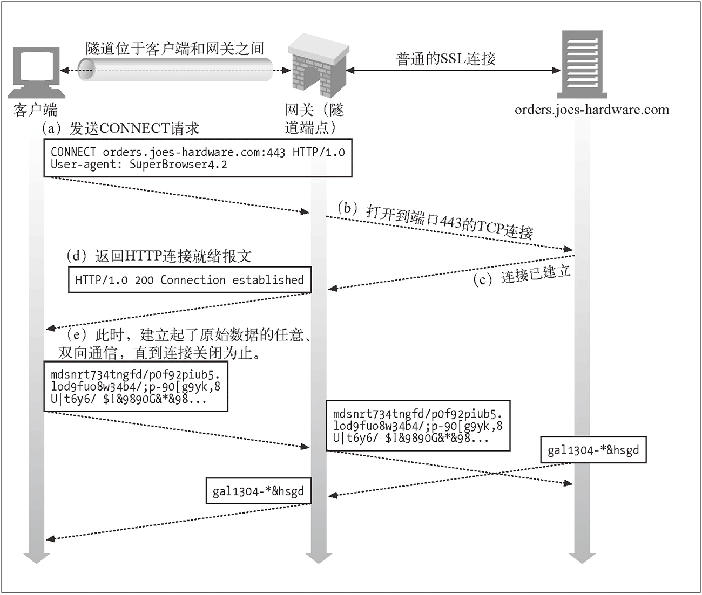
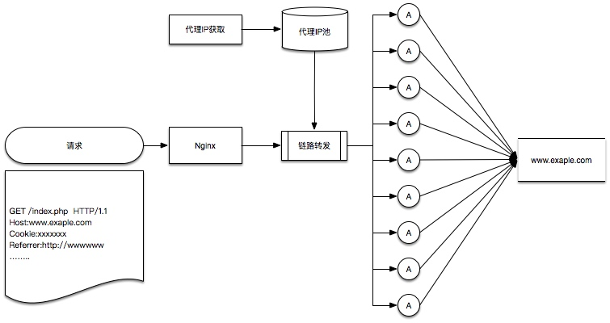

# Dproxy
Massive Distributed Dynamic Proxy

## 介绍
动态代理，也称拨号代理、动态VPS代理等等，特点是代理服务器的IP地址可以频繁变动。从IP维度上看，平均每个代理IP的有效期不超过5分钟。
动态代理的一个重要问题是，IP地址平凡变动，在爬虫运行过程中，需要动态地对脚本中的代理进行设置。而且，某些情况下，不允许动态地对代理进行设置。
比如E语言，默认是使用系统代理的，不可能每次都去修改。
比如PhantomJS，需要在启动的时候设置好代理，直到运行结束都一直用一个代理。

所以，就需要一个可靠的、稳定的代理分发系统，并且，需要同时支持HTTP 和HTTPS协议。
为什么要强调协议这个问题？因为目前流行的代理工具中，Nginx无疑是最强大的，但是Nginx不能支持HTTPS代理，Squid/HAProxy支持HTTP/HTTPS代理，但是无法满足分发的需求。

所以我们利用Openresty来做了一些改进，使得Nginx能够成为一款出色的代理分发工具。

## Demo

http://47.97.116.23:8080

## 使用方式：

	$ curl 'http://myip.ipip.net' -x 'http://47.97.116.23:8080'
	
	$ curl 'https://myip.ipip.net' -x 'http://47.97.116.23:8080' -k

注：curl中，-x表示设置代理，-k表示不验证证书

python代理示例

	import requests

	proxy={
    	"http":"http://47.97.116.23:8080",
    	"https":"http://47.97.116.23:8080"
	}

	res = requests.get(url = "http://myip.ipip.net",proxies=proxy).content
	print res

	res = requests.get(url = "https://myip.ipip.net",proxies=proxy,verify=False).content
	print res

## 特别说明

在HTTPS的代理中，客户端发送的第一个请求为CONNECT请求，要求代理服务器，与目标站点建立HTTP Tunnel，然后在Tunnel中，客户端与目标站点直接对话。

在这种情况下，是无法动态分发请求的，依然需要每次动态设置代理。

解决办法是，在代理服务器上，对HTTPS请求进行拆包，然后在分发到各个节点上去。
这个过程中，由于HTTPS协议的一些特性，代理服务器使用了自签名证书，访问过程中会出现证书校验不通过的情况。

## 架构
openresty v1.13.6.1

nginx v1.12.2 (ngx_http_proxy_connect_module最高支持1.12版本)

ngx_http_proxy_connect_module (Nginx天生不支持CONNECT请求，使用这个模块，可以使Nginx也能够处理CONNECT请求)

其他：
lua-resty-http （代理分发，实际上是由Nginx代替你，来完成后面的请求操作，再把结果原模原样返回给你，依赖于这个模块）

lua-resty-dns （代理分发过程中，DNS由代理的最后一条负责解析，但是试验中，Nginx本地也会做一次解析，严重影响了代理分发的性能，所以在Nginx上强制关闭了DNS解析）

整套系统的成本不到100块钱/月，主要的成本还是在动态IP的获取上，一个月下来，还是需要不少钱。

